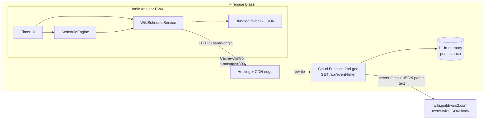
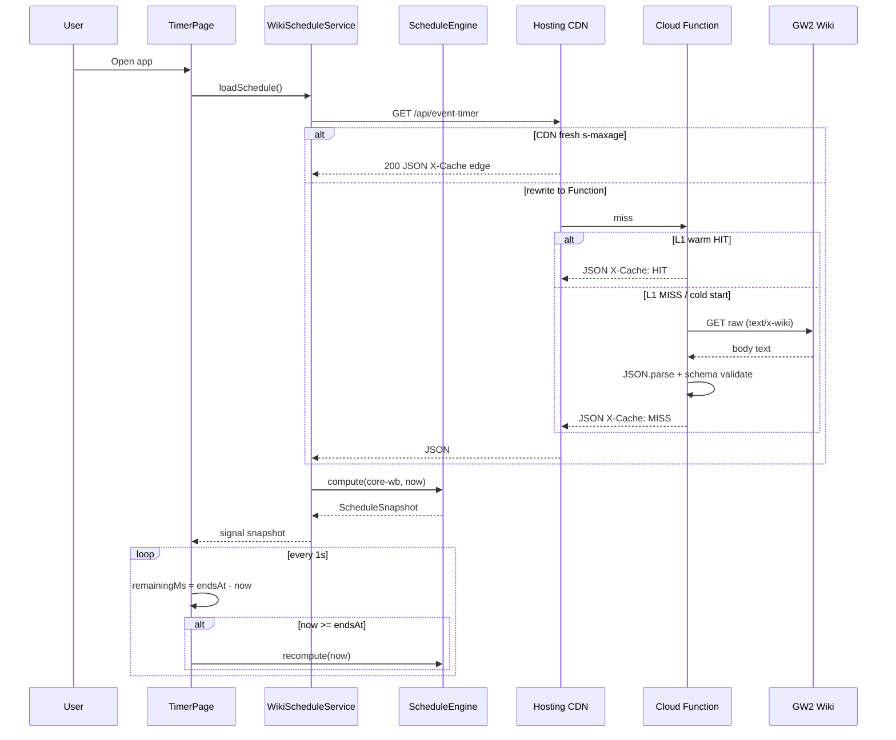
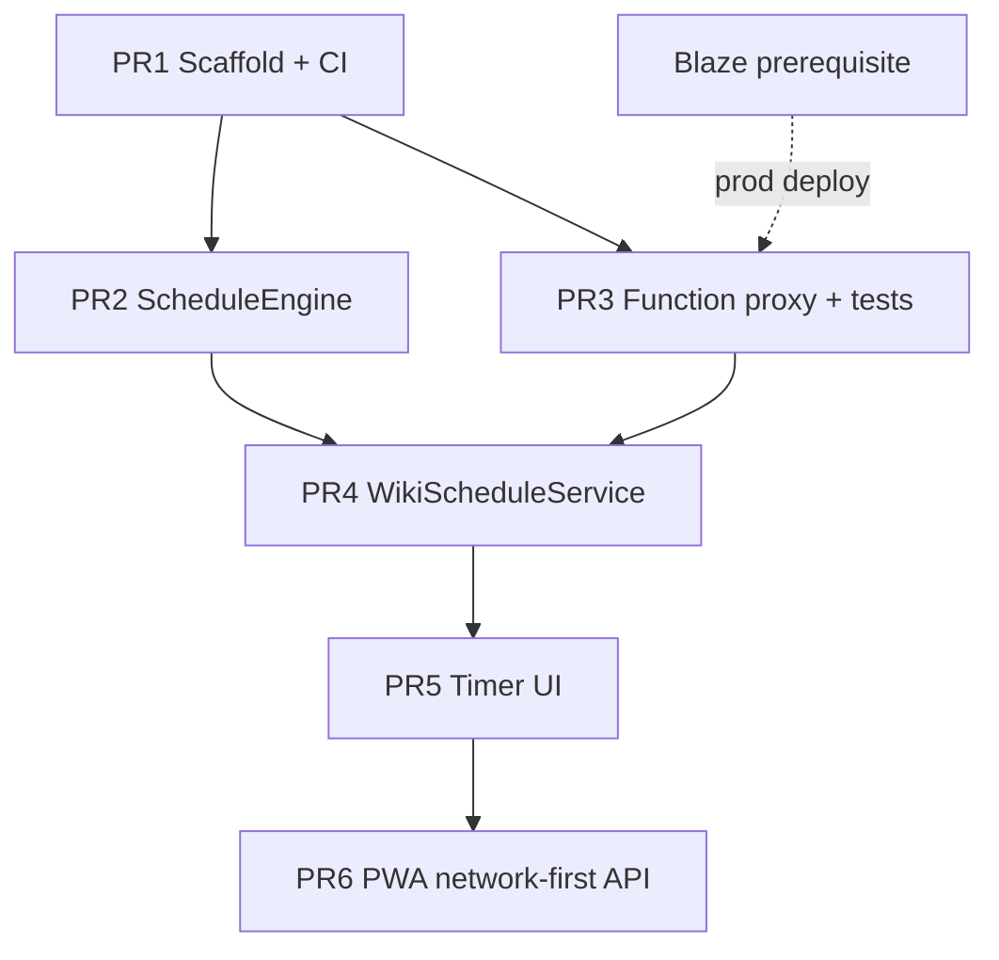

# Guild Wars 2 Upcoming World Boss Timer — Technical Design Document

| Field | Value |
|-------|-------|
| **Author** | Project Owner |
| **Date** | 2026-09-21 |
| **Status** | Draft |
| **App title** | GW2 World Bosses |
| **Stack** | Ionic / Angular / Firebase |
| **Firebase project** | `gw2-world-boss-timer` |
| **Project path** | `/Users/todd/dev/angular/projects/gw_world_boss_timer` |
| **Design session path** | `/Users/todd/AFK Pilot/GW2 World Bosses` (spec/working notes only) |

---

## Overview

Players of Guild Wars 2 need a reliable way to know which Core Tyria world boss is active right now and which bosses are coming next. The official GW2 API (`api.guildwars2.com/v2`) does **not** expose world boss schedules: `/v2/worldbosses` returns only IDs, and `/v2/account/worldbosses` returns kills since daily reset (authenticated). The community-maintained Guild Wars 2 Wiki Event Timer widget JSON is the de facto schedule source used by in-wiki timers and third-party tools.

This document specifies **GW2 World Bosses**, an **Ionic Angular PWA** (app code not yet scaffolded; Firebase project already initialized) that:

1. Fetches schedule data for `events["core-wb"]` via a **Firebase Cloud Function** proxy/cache (CORS + reliability).
2. Computes the **current active boss** and the **next 3** bosses from UTC midnight using the wiki `sequences.pattern` (6-hour / 24×15-minute cycle).
3. Renders a focused timer UI with countdown and boss metadata (name, color, chatlink copy + how-to tip, wiki link).
4. Deploys the SPA on **Firebase Hosting**.

MVP is intentionally narrow: Core Tyria world bosses only (`core-wb`), current + next 3, no account kill-tracking, no hard bosses, no push notifications, **no client telemetry**. Phase 2 starts with hard world bosses (`core-hwb`).

**Billing prerequisite:** the chosen proxy architecture requires a Firebase **Blaze** (pay-as-you-go) project. See Key Decision 11 and Rollout prerequisites.

---

## Background & Motivation

### Current state

- **Implementation root:** `/Users/todd/dev/angular/projects/gw_world_boss_timer`.
- Firebase is **already initialized** in that folder:
  - `.firebaserc` → `default: gw2-world-boss-timer` (matches KD 13).
  - `firebase.json` — Hosting (`public/`), Firestore rules/indexes, Auth emulator stubs, SPA rewrite to `/index.html`.
  - `public/index.html` — Firebase Hosting welcome placeholder (not the Ionic app).
  - No Ionic/Angular/`src/` app, no Cloud Functions codebase, no schedule logic yet.
- Auth and Firestore are stubbed by the Firebase CLI init; **MVP does not use them** (KD 9). PR 1 evolves Hosting/`firebase.json` for the Ionic build output and adds Functions; it does not re-create the Firebase project.
- Official API cannot power an upcoming-boss timer (confirmed via wiki API docs / Context7 `/websites/wiki_guildwars2_wiki_api`). The obsolete v1 events API was removed with Megaservers; a rotating world boss schedule API was discussed but never shipped.
- Wiki widget data lives at:

  `https://wiki.guildwars2.com/index.php?title=Widget:Event_timer/data.json&action=raw`

  Current `config.version`: **v5.4** (as of research / live fetch).

### Pain points this app addresses

| Pain | Mitigation in this design |
|------|---------------------------|
| No official schedule API | Use wiki `core-wb` segments + sequences |
| Browser CORS / wiki downtime | Firebase Function proxy with short TTL cache (CDN as shared layer) |
| Hard to glance next bosses while AFK/planning | Compact UI: current + countdown + next 3 |
| Clock / timezone confusion | All schedule math in **UTC**; UI shows relative ETA primary + local absolute secondary |

### Verified `core-wb` facts (live JSON)

- **10 bosses** in `segments` (IDs `"1"`…`"10"`).
- `sequences.partial`: `[]` (empty) → schedule aligns from **00:00 UTC** via repeating pattern.
- `sequences.pattern`: 24 slots × `d: 15` minutes = **360 minutes (6h) cycle**.
- Pattern `r` order: `1,2,3,4,5,6,7,8,10,2,9,4, 1,6,3,8,5,2,7,4,10,6,9,8`.
- **Duplicate segment IDs are normal:** several `r` values repeat within the 24-slot cycle (e.g. Svanir `r=2` appears three times; `4`, `6`, `8` twice). Occurrences are **time-keyed** (`startsAt`), not unique by `r`. UI and tests must **not** dedupe by segment id.
- Hard bosses (Tequatl, Triple Trouble, Karka Queen) live under `core-hwb` — **out of MVP scope**.
- Wiki raw response `Content-Type` is `text/x-wiki; charset=UTF-8` with a JSON body (not `application/json`). Response has **no** `Access-Control-Allow-Origin` (browser-direct fetch blocked). Upstream also advertises `Cache-Control: max-age=18000` (5h); our Function/CDN TTL is intentionally shorter.

---

## Goals & Non-Goals

### Goals (MVP)

1. Scaffold Ionic Angular standalone app + AngularFire + Firebase Hosting/Functions with pinned runtimes.
2. Proxy and cache wiki Event Timer JSON behind a Cloud Function HTTP endpoint (Blaze project).
3. Implement a pure TypeScript schedule engine for `core-wb` that returns current boss + next 3 with absolute UTC `startsAt`/`endsAt`.
4. Ship a single primary screen: current boss (name, accent color, countdown) and next 3 bosses (relative ETA + local absolute time).
5. Support PWA install (manifest + service worker) for desktop/mobile web use; **network-first** for `/api/**`.
6. Unit-test schedule math against known UTC offsets (including both sides of every 15-minute boundary).

### Non-Goals (MVP) / Later phases

| Item | Phase |
|------|-------|
| Hard world bosses (`core-hwb`) | **Phase 2 first** (highest priority after MVP) |
| Full multi-map event timer (HoT/PoF/EoD/etc.) / non-empty `partial` categories | Phase 2+ |
| GW2 API key / account kill tracking (`/v2/account/worldbosses`) | Phase 2+ (after `core-hwb`) |
| Push / local notifications before spawn | Phase 2+ |
| Firebase Analytics / other client telemetry | Out of MVP; revisit only if product needs change |
| Capacitor native iOS/Android shells | Phase 3 (optional) |
| User accounts, Firestore sync across devices | Phase 2 (prefs only optional in MVP via localStorage) |
| In-game overlay / MumbleLink | Out of scope |
| Persisted server-side last-good cache (Cloud Storage) | Phase 2 (MVP uses CDN + client bundled fallback) |

---

## Proposed Design

### High-level architecture



**Data flow (happy path):**

1. App boots → `WikiScheduleService` requests `/api/event-timer` (Firebase Hosting rewrite → Function).
2. CDN may serve a cached 200 within `s-maxage`; else Function uses warm L1 if present, else fetches wiki, returns body with `Cache-Control`.
3. Client extracts `events["core-wb"]`, passes to `ScheduleEngine.compute(now)`.
4. UI binds to signals: `current`, `upcoming[3]`, `remainingMs`; a 1s tick refreshes countdown from `endsAt - now`; recomputes slot when `now >= current.endsAt`.

### Project layout (proposed)

Root: `/Users/todd/dev/angular/projects/gw_world_boss_timer`

```
/
├── angular.json / ionic.config.json / capacitor.config.ts (optional later)
├── .firebaserc                # already present: default gw2-world-boss-timer
├── firebase.json              # evolve from current Hosting/Firestore stubs
├── .github/workflows/ci.yml   # ng test + functions tests (from PR 1/2)
├── firestore.rules            # already present; unused in MVP
├── firestore.indexes.json     # already present; unused in MVP
├── public/                    # replace Hosting welcome page with Ionic build output (or retarget public → www/dist)
├── functions/
│   ├── package.json           # engines.node pinned
│   ├── src/
│   │   ├── index.ts           # export eventTimer (2nd gen onRequest)
│   │   ├── wiki-proxy.ts
│   │   └── wiki-proxy.spec.ts # required
│   └── tsconfig.json
├── src/
│   ├── main.ts
│   ├── app/
│   │   ├── app.component.ts
│   │   ├── app.routes.ts
│   │   ├── core/
│   │   │   ├── models/wiki-event-timer.ts
│   │   │   ├── models/boss-schedule.ts
│   │   │   ├── services/wiki-schedule.service.ts
│   │   │   └── schedule/schedule-engine.ts
│   │   └── features/timer/
│   │       ├── timer.page.ts
│   │       ├── components/current-boss-card.ts
│   │       ├── components/upcoming-boss-list.ts
│   │       └── components/countdown-display.ts
│   ├── assets/fallback/core-wb-snapshot.json
│   ├── environments/
│   ├── testing/fixtures/core-wb.json
│   ├── theme/
│   ├── index.html
│   └── manifest.webmanifest
└── docs/design-world-boss-timer.md
```

### Stack choices (pinned for scaffold)

| Layer | Choice | Pin / knobs |
|-------|--------|-------------|
| UI | Ionic **9.x** + Angular standalone | **Scaffolded:** Ionic `^9.0.0` + Angular `22.1.7` (Ionic CLI current peer matrix, 2026-09-21). `@angular/fire` deferred — published `20.x` peers Angular `^20` only; deploy via Firebase CLI. |
| State | Angular signals + `computed()` | No NgRx |
| Backend | Firebase Cloud Functions **2nd gen** `onRequest` | **Node.js 20**, region **`us-central1`**, memory **256MiB**, `timeoutSeconds: 10` (upstream fetch abort ~8s) |
| Hosting | Firebase Hosting | Rewrite `/api/**` → `eventTimer`; export name must match |
| Tooling | `firebase-tools` latest at scaffold; lock in package.json | Document in README |
| Persistence | None required for MVP; `localStorage` for theme/prefs | Avoids Auth |
| Time | Always compute in UTC via `Date.UTC` | Matches wiki convention |
| Billing | **Firebase Blaze** | Required for Functions + outbound wiki fetch (see KD 11) |

### Schedule computation algorithm (precise)

**Invariant (half-open intervals):** a slot covering minute offsets `[slotStart, slotEnd)` is active iff `slotStart <= offset < slotEnd`. At an exact boundary (e.g. `00:15:00.000Z`), the **previous** slot has ended and the **next** slot is active.

**Inputs**

- `segments: Record<string, WikiSegment>`
- `sequences.partial: WikiPatternSlot[]` (empty for `core-wb` in MVP)
- `sequences.pattern: WikiPatternSlot[]` where `WikiPatternSlot = { r: number; d: number }`
- `now: Date` (caller supplies; tests inject fixed instants)
- `upcomingCount` default **3**

**Constants for core-wb**

- Slot durations come from data (`d_i`); currently all `15`. Do not hardcode 15 in the engine.
- Pattern duration `P = Σ pattern[i].d` → **360** minutes.
- Day length `D = 1440` minutes.

#### Normative absolute-time algorithm (MVP)

MVP implements the **empty-`partial` path** (verified for `core-wb`). The public engine API accepts `WikiSequences` so Phase 2 can add a real `partial` prefix without renaming types. **Do not claim full partial semantics in MVP tests.**

```
function utcMidnight(now: Date): Date
  return new Date(Date.UTC(
    now.getUTCFullYear(), now.getUTCMonth(), now.getUTCDate(),
    0, 0, 0, 0))

function minutesSinceUtcMidnight(now: Date): number
  // Fractional minutes so sub-minute boundaries are correct
  return (now.getTime() - utcMidnight(now).getTime()) / 60000

function patternDuration(pattern): number
  return sum(slot.d for slot in pattern)

function findInPattern(pattern, cycleOffset): { index, slotStartInCycle, slotEndInCycle }
  // cycleOffset in [0, P)
  // Walk cumulative durations; return slot where
  //   slotStartInCycle <= cycleOffset < slotEndInCycle
  // Half-open: at exactly slotEndInCycle, that slot is NOT active.

function compute(data, now, { upcomingCount = 3 } = {}): ScheduleSnapshot
  const core = data.events["core-wb"]
  const pattern = core.sequences.pattern
  // MVP: assert or treat partial as empty; if partial.length > 0, throw or
  // fall through to Phase-2 builder (not required for MVP ship).
  const P = patternDuration(pattern)
  const midnight = utcMidnight(now)
  const offsetMin = minutesSinceUtcMidnight(now)   // e.g. 1430.0 at 23:50
  const cycleOffset = ((offsetMin % P) + P) % P    // guard negative
  const { index, slotStartInCycle, slotEndInCycle } = findInPattern(pattern, cycleOffset)

  // Minutes from this UTC midnight to the start of the active slot:
  // align to the beginning of the current cycle, then add slotStartInCycle.
  // Absolute times use minutes-since-day-start (may exceed 1440); Date overflow
  // crosses into the next UTC day. Segment metadata + addMinutes are inlined
  // here (no separate occurrenceFromCycle helper).
  const cycleStartFromMidnight = offsetMin - cycleOffset  // == P * floor(offsetMin/P)
  const currentStartMin = cycleStartFromMidnight + slotStartInCycle
  const currentEndMin = cycleStartFromMidnight + slotEndInCycle

  current = {
    ...mapSegment(pattern[index].r),
    startsAt: addMinutes(midnight, currentStartMin),
    endsAt:   addMinutes(midnight, currentEndMin),
  }

  upcoming = []
  let nextIndex = index
  let nextStartMin = currentEndMin
  for k in 1..upcomingCount:
    nextIndex = (nextIndex + 1) % pattern.length
    const dur = pattern[nextIndex].d
    const nextEndMin = nextStartMin + dur
    upcoming.push({
      ...mapSegment(pattern[nextIndex].r),
      startsAt: addMinutes(midnight, nextStartMin),
      endsAt:   addMinutes(midnight, nextEndMin),
    })
    nextStartMin = nextEndMin

  return {
    version: data.config.version,
    computedAt: now,
    current,
    upcoming,
    remainingMs: current.endsAt.getTime() - now.getTime(),
  }

function addMinutes(base: Date, minutes: number): Date
  return new Date(base.getTime() + minutes * 60_000)
```

**Why this yields correct midnight wraps:** `addMinutes(midnight, 1440)` is `00:00Z` next day; `addMinutes(midnight, 1455)` is `00:15Z` next day. Upcoming slots never need a separate “next day” branch—the minute cursor simply continues past 1440.

**Phase 2 note (non-normative for MVP):** categories with non-empty `partial` use a one-shot prefix each UTC day: concatenate `partial` once from `00:00 UTC`, then append `pattern` repeatedly until coverage ≥ `1440 + lookaheadMinutes` (lookahead ≥ sum of next `upcomingCount` slot durations). MVP does **not** implement or unit-test that path.

#### Output shape

```typescript
interface BossOccurrence {
  segmentId: string;
  name: string;
  link?: string;
  chatlink?: string;
  bg: [number, number, number]; // RGB
  startsAt: Date;  // UTC instant
  endsAt: Date;    // UTC instant (exclusive boundary for “active” checks)
}

interface ScheduleSnapshot {
  version: string;           // config.version from wiki JSON
  computedAt: Date;
  current: BossOccurrence;
  upcoming: BossOccurrence[]; // length === upcomingCount (3)
  remainingMs: number;       // current.endsAt - now (may be 0 at boundary before recompute)
}
```

#### Deterministic examples (half-open)

Pattern indices 0..23 with `r`:  
`1,2,3,4,5,6,7,8,10,2,9,4, 1,6,3,8,5,2,7,4,10,6,9,8` — each `d=15`.

| `now` (UTC) | offsetMin | Active | `startsAt`–`endsAt` | Next 3 (`r`) |
|-------------|-----------|--------|---------------------|--------------|
| `2026-09-21T00:00:00.000Z` | 0 | `r=1` Taidha (idx 0) | `00:00`–`00:15` | 2, 3, 4 |
| `2026-09-21T00:14:59.000Z` | ≈14.983 | still `r=1` | same | 2, 3, 4 |
| `2026-09-21T00:15:00.000Z` | 15 | `r=2` Svanir (idx 1) | `00:15`–`00:30` | 3, 4, 5 |
| `2026-09-21T02:14:59.000Z` | ≈134.983 | `r=10` Golem (idx 8), slot `[120,135)` | `02:00`–`02:15` | 2, 9, 4 |
| `2026-09-21T02:15:00.000Z` | **135** | `r=2` Svanir (idx 9), slot `[135,150)` | `02:15`–`02:30` | **9, 4, 1** |
| `2026-09-21T23:50:00.000Z` | 1430 | `r=8` Shadow Behemoth (idx 23), cycleOffset `1430 % 360 = 350`, slot `[345,360)` | `23:45`–`00:00` **next day** | see below |

**Midnight-crossing worked example** — `now = 2026-09-21T23:50:00.000Z`:

- `midnight = 2026-09-21T00:00:00.000Z`
- `offsetMin = 1430`, `P = 360`, `cycleOffset = 350`
- Active index 23 (`r=8` Shadow Behemoth): `slotStartInCycle=345`, `slotEndInCycle=360`
- `cycleStartFromMidnight = 1430 - 350 = 1080`
- `currentStartMin = 1080 + 345 = 1425` → `startsAt = 2026-09-21T23:45:00.000Z`
- `currentEndMin = 1080 + 360 = 1440` → `endsAt = 2026-09-22T00:00:00.000Z`
- `remainingMs = 10 * 60_000`
- Upcoming (cursor starts at 1440):
  1. idx 0 `r=1` Taidha — `2026-09-22T00:00:00.000Z` → `00:15Z`
  2. idx 1 `r=2` Svanir — `00:15Z` → `00:30Z`
  3. idx 2 `r=3` Megadestroyer — `00:30Z` → `00:45Z`

**Required unit tests (PR 2):** both sides of every fixture boundary (`T-1ms` / `T+0`); wrap across pattern end (idx 23 → 0); leap across UTC day as above; upcoming may repeat the same `r` at different `startsAt` (e.g. after Golem idx 8, upcoming includes Svanir even though Svanir also appears earlier in the cycle).

#### Client refresh strategy

- Fetch wiki JSON once per app session (or when cache `version` / client revalidation fires).
- Recompute snapshot when `now >= current.endsAt` or every 60s as safety.
- Tick countdown every 1s from `endsAt.getTime() - Date.now()` (do not decrement a local counter alone).



### Firebase usage

#### Project ID

- **Existing Firebase project:** `gw2-world-boss-timer` (Hosting + `eventTimer` Function).
- **Local folder:** `/Users/todd/dev/angular/projects/gw_world_boss_timer`.
- `.firebaserc` is **already present** and correct:

```json
{
  "projects": {
    "default": "gw2-world-boss-timer"
  }
}
```

#### Billing / plan

- **Required:** Firebase **Blaze** (pay-as-you-go) on `gw2-world-boss-timer`. Spark cannot deploy Cloud Functions that perform arbitrary outbound HTTPS to `wiki.guildwars2.com`.
- Set a **budget alert** (e.g. $5–10/month) on the linked billing account.
- Expected cost at hobby traffic: near-zero within Functions free-tier quotas when TTL ≥ 5 minutes and CDN `s-maxage` absorbs repeats.
- **If Blaze is not enabled on this project:** do not deploy PR 3 to production; fall back to Alternative 6 (bundled snapshot only) until Blaze is active.

#### Hosting

- Serve Angular/Ionic production build from `www/` or `dist/.../browser` (path fixed at scaffold).
- Rewrite + cache headers:

```json
{
  "hosting": {
    "public": "www",
    "ignore": ["firebase.json", "**/.*", "**/node_modules/**"],
    "rewrites": [
      { "source": "/api/**", "function": "eventTimer" },
      { "source": "**", "destination": "/index.html" }
    ],
    "headers": [
      {
        "source": "/api/**",
        "headers": [
          { "key": "Cache-Control", "value": "public, max-age=60, s-maxage=300" }
        ]
      }
    ]
  }
}
```

For 2nd-gen functions, ensure `firebase.json` / codebase discoverability matches the Firebase CLI version used at scaffold (document exact `firebase.json` `functions` block in PR 1 README). Region for `eventTimer`: **`us-central1`**.

#### Cloud Function `eventTimer` — cache layers

| Layer | Scope | TTL / behavior |
|-------|--------|----------------|
| **CDN / Hosting edge** (`s-maxage=300`) | Shared across users | **Primary shared cache for MVP.** Latency target “cache hit p95 < 150ms” means **edge HIT**. |
| **L1 in-memory** on Function instance | Single warm instance only | TTL **300s**. Cold start = empty L1 = MISS. Multiple instances do **not** share L1. Scale-to-zero drops L1 “last-good”. |
| **Client bundled fallback** | App binary | Real durability if wiki + all server caches fail (Key Decision 10). |
| Wiki upstream `max-age=18000` | Wiki CDN | Informational; Function still re-fetches on its own TTL. |

Responsibilities:

1. `GET` only; respond `405` otherwise.
2. L1 module cache: `{ fetchedAt, version, body }` with TTL **300s**.
3. On L1 miss: `fetch(WIKI_URL, { headers: { Accept: 'application/json, text/plain, */*', 'User-Agent': 'GW2-WorldBossTimer/1.0' } })` with **~8s** abort (Function timeout **10s**).
4. **Parse:** `const text = await res.text(); const data = JSON.parse(text)`. **Do not** reject based on upstream `Content-Type` (live value is `text/x-wiki; charset=UTF-8`).
5. Validate parsed object has `config.version` and `events["core-wb"]` with `segments` + `sequences.pattern`. On failure: if L1 has last-good on **this** instance, return it with `X-Cache: STALE`; else `502`. **Do not** promise multi-hour stale across cold starts—that durability is CDN freshness + client bundled fallback.
6. Response headers: `Content-Type: application/json`, `X-Wiki-Config-Version`, `X-Cache: HIT|MISS|STALE`, `Cache-Control` consistent with Hosting header intent. Set permissive CORS for emulator / direct function URL; production path is same-origin Hosting rewrite (wiki itself sends **no** ACAO — proxy remains justified).
7. Default body: trimmed `{ config, events: { "core-wb": ... } }` (~small vs ~45KB full file). `?full=1` returns entire wiki JSON for debugging.

**Env / secrets:** none required for MVP (public wiki URL).

#### Firestore (optional, deferred)

- Not required for MVP.
- If added later: `users/{uid}/prefs` for favorite bosses, notification lead time — requires Firebase Auth.

### TypeScript interfaces (wiki JSON shape for `core-wb`)

```typescript
/** Top-level wiki Widget:Event_timer/data.json */
export interface WikiEventTimerData {
  config: {
    version: string;
    comment1?: string;
    comment2?: string;
  };
  events: Record<string, WikiEventCategory>;
}

export interface WikiEventCategory {
  category: string;
  name: string;
  link?: string;
  segments: Record<string, WikiSegment>;
  sequences: WikiSequences;
}

export type WikiBg =
  | [number, number, number]
  | Array<[number, number, number] | string>
  | string;

export interface WikiSegment {
  name: string;
  link?: string;
  chatlink?: string;
  bg: WikiBg;
}

export interface WikiPatternSlot {
  /** Segment id (numeric in JSON; keys in segments are strings). */
  r: number;
  /** Duration in minutes. */
  d: number;
}

export interface WikiSequences {
  /** One-shot UTC-day prefix in Phase 2; empty for core-wb MVP. */
  partial: WikiPatternSlot[];
  pattern: WikiPatternSlot[];
}

/** App-normalized segment (MVP assumes solid RGB triple). */
export interface NormalizedSegment {
  id: string;
  name: string;
  link?: string;
  chatlink?: string;
  bg: [number, number, number];
}
```

Normalization helper: if `bg` is not a 3-number RGB tuple, fall back to Ionic CSS variable / default `#d76464`.

### Timer UI specification

**Route:** `/` → `TimerPage` (only MVP route).

**MVP time-display default (Key Decision 12):** each upcoming row shows **relative ETA primary** (`in 08:42`) and **local absolute secondary** (e.g. `2:15 PM`). Footer: `Schedule {version} · local times`. Phase 2 may add a `localStorage` toggle.

**Layout (mobile-first, Ionic)**

```
┌─────────────────────────────────────┐
│  GW2 World Bosses          ↻  ⋮     │  ion-header
├─────────────────────────────────────┤
│  CURRENT                            │
│  ┌───────────────────────────────┐  │
│  │ ■ Admiral Taidha Covington    │  │  accent from bg RGB
│  │   Ends in  08:42              │  │  relative primary
│  │   2:15 PM local               │  │  absolute secondary
│  │   [Copy chatlink]  [Wiki ↗]   │  │
│  │   ▸ How to use chat codes     │  │  expandable tip
│  └───────────────────────────────┘  │
│                                     │
│  UP NEXT                            │
│  1. Svanir Shaman Chief             │
│       in 08:42 · 2:15 PM            │  same boss name may
│  2. Megadestroyer                   │  reappear later — OK
│       in 23:42 · 2:30 PM            │  (time-keyed rows)
│  3. Fire Elemental                  │
│       in 38:42 · 2:45 PM            │
│                                     │
│  Schedule v5.4 · local times        │  footer meta
└─────────────────────────────────────┘
```

**Behaviors**

| Element | Behavior |
|---------|----------|
| Current name | From `segments[r].name` |
| Accent bar / card border | `rgb(bg[0], bg[1], bg[2])` |
| Countdown | Live `endsAt - now`, format `m:ss` or `h:mm:ss`; relative primary |
| Local absolute | `startsAt`/`endsAt` formatted with `Intl.DateTimeFormat` in browser TZ |
| App title | **GW2 World Bosses** in `ion-title` / PWA manifest `name` + `short_name` |
| Copy chatlink | `navigator.clipboard.writeText(chatlink)`; toast on success |
| Chatlink how-to | Expandable tip (e.g. `ion-accordion` / disclosure) under Copy: brief steps — paste the code into GW2 chat (Enter) to open the waypoint/map link; for players new to chat codes. Collapsed by default. |
| Wiki link | `https://wiki.guildwars2.com/wiki/${encodeURIComponent(link)}` |
| Refresh | Manual re-fetch; pull-to-refresh on `ion-content` |
| Next 3 rows | **One row per occurrence** keyed by `startsAt`; **never dedupe by `segmentId`/`r`** |
| Loading / error | Skeleton cards; error banner with Retry if proxy fails; auto-use bundled fallback when configured |
| Dark mode | Follow system via Ionic `prefers-color-scheme` |
| Telemetry | **None** in MVP — no Firebase Analytics, no third-party analytics SDKs |

**Accessibility**

- Pass axe / WCAG AA: contrast on colored accents (text on dark surface, not on saturated `bg` fill alone).
- Countdown updates must not spam screen readers every second — announce at 60s / 10s / 0 or use visually hidden polite region sparingly.

### Key services

```typescript
@Injectable({ providedIn: 'root' })
export class WikiScheduleService {
  private readonly http = inject(HttpClient);
  private readonly engine = inject(ScheduleEngine);

  readonly snapshot = signal<ScheduleSnapshot | null>(null);
  readonly loadState = signal<'idle' | 'loading' | 'error' | 'ready'>('idle');
  readonly errorMessage = signal<string | null>(null);

  async refresh(): Promise<void> { /* GET /api/event-timer → engine.compute; else bundled fallback */ }

  tick(now = new Date()): void {
    const snap = this.snapshot();
    if (!snap) return;
    if (now.getTime() >= snap.current.endsAt.getTime()) {
      // recompute from cached core-wb payload
    } else {
      this.snapshot.update(/* remainingMs from endsAt - now */);
    }
  }
}
```

`ScheduleEngine` must be **pure** (no DI HTTP) so unit tests do not need TestBed HTTP mocks.

---

## API / Interface Changes

Greenfield — no existing public API. New contracts:

### `GET /api/event-timer`

| | |
|--|--|
| **Query** | `full=1` optional — return entire wiki JSON; default trimmed to `config` + `events["core-wb"]` |
| **200** | JSON body as above; headers `X-Wiki-Config-Version`, `X-Cache: HIT\|MISS\|STALE` |
| **502** | Wiki unreachable / invalid and no L1 last-good on this instance |
| **504** | Upstream timeout |
| **405** | Non-GET |

### Client `ScheduleEngine` public API

```typescript
class ScheduleEngine {
  compute(
    data: Pick<WikiEventTimerData, 'config'> & { events: { 'core-wb': WikiEventCategory } },
    now?: Date,
    options?: { upcomingCount?: number } // default 3
  ): ScheduleSnapshot;
}
```

---

## Data Model Changes

No database in MVP. Caches: Hosting CDN (`s-maxage`), per-instance Function L1, client memory + bundled asset.

**If Firestore prefs are added later:**

```
prefs/{deviceOrUid}
  theme: 'system' | 'dark' | 'light'
  showLocalTime: boolean
  favoriteSegmentIds: string[]
```

Migration: extend the existing Firebase CLI scaffold in `/Users/todd/dev/angular/projects/gw_world_boss_timer` (keep `.firebaserc`; evolve `firebase.json` Hosting `public` + add Functions rewrite; leave Auth/Firestore unused for MVP).

**Client memory model:** hold last successful trimmed payload in a service private field for offline recompute of the rotating pattern even if network drops mid-session (pattern is static for a `config.version`).

---

## Alternatives Considered

### 1. Fetch wiki JSON directly from the browser

| Pros | Cons |
|------|------|
| No Functions cost / no Blaze | **CORS blocked** (no ACAO on wiki raw JSON); brittle; no shared cache; harder to trim |

**Decision:** Reject for production path; Function proxy is required given verified CORS. Emulator/dev may allow direct fetch behind a flag only if a CORS-capable mirror exists (it does not for wiki).

### 2. Hardcode the 24-slot pattern in the client

| Pros | Cons |
|------|------|
| Zero network dependency for schedule | Diverges when wiki bumps `config.version` / reorders bosses; still need metadata (names, chatlinks, colors) |

**Decision:** Reject as sole source. Optionally ship a **bundled fallback snapshot** (last-known JSON) for emergency offline, invalidated when live `version` differs.

### 3. Scrape HTML wiki pages or third-party timer sites

| Pros | Cons |
|------|------|
| Sometimes prettier data | More fragile than structured JSON; ToS/ethical issues; extra parsers |

**Decision:** Reject. Prefer the widget JSON.

### 4. Wait for official ArenaNet schedule API

| Pros | Cons |
|------|------|
| First-party correctness | Does not exist; historical plans never shipped |

**Decision:** Not viable for MVP timeline.

### 5. NgRx / complex state store

| Pros | Cons |
|------|------|
| Scales for large apps | Overkill for one screen + one snapshot signal |

**Decision:** Signals-only for MVP.

### 6. Bundled snapshot only (no Cloud Function)

| Pros | Cons |
|------|------|
| Works on **Spark** / no outbound Functions; zero wiki runtime dependency; simplest ops | Stale until app release or manual/CI refresh; no live `config.version` detection without some network path; worse UX when wiki rotation changes |

**Decision:** **Rejected as the primary production path** for project `gw2-world-boss-timer` while Blaze is enabled—Hosting rewrite + Function was chosen for live version tracking, trimmed payloads, and CORS. **Accepted as contingency** if Blaze cannot be enabled on that project, and as the **emergency client fallback** even when Functions are deployed (KD 10). CI can refresh `src/assets/fallback/core-wb-snapshot.json` on a schedule in that contingency mode.

---

## Security & Privacy Considerations

| Topic | Approach |
|-------|----------|
| Auth | None in MVP — public schedule data |
| API keys | No GW2 API keys stored |
| PII | None collected |
| Telemetry | **Zero client telemetry in MVP** — do not add Firebase Analytics, Measurement ID, or third-party trackers (KD 17). Ops may still use Cloud Logging on the Function (server-side, no end-user profiling). |
| Function abuse | Rate-limit via platform defaults; App Check optional Phase 2; CDN + TTL reduce wiki load |
| XSS | Angular default sanitization; do not `innerHTML` wiki fields; chatlink is plain text copy |
| Supply chain | Pin Ionic/Angular/Firebase deps at scaffold; Dependabot later |
| Attribution | Credit GW2 Wiki / ArenaNet; follow NCsoft / GW2 fan content guidelines (non-commercial, no IP infringement). App title **GW2 World Bosses** is fan naming, not official ArenaNet branding. |
| Billing | Blaze with budget alerts to avoid surprise cost |

**Threat model (brief):** Attacker cannot escalate privileges (no auth). Main risks are availability (wiki or function down) and cache poisoning of the function's upstream fetch — mitigate with JSON schema validation (required keys) before replacing L1 cache.

---

## Observability

| Signal | How |
|--------|-----|
| Function invocations / errors / latency | Cloud Functions metrics + Cloud Logging |
| Cache hit ratio | `X-Cache: HIT\|MISS\|STALE`; counters; log cold-start MISS explicitly |
| Wiki upstream failures | Structured log `{ event: 'wiki_fetch_failed', status, ms, contentType }` |
| Client errors | MVP: `console.error` + in-UI banner only — **no** Analytics / crash reporters (KD 17) |
| Schedule correctness | Unit tests (boundary pairs + midnight cross); manual QA vs wiki widget |

**Alerting (post-MVP):** notify if function error rate > 5% / 5min or wiki fetch fails for > 15 minutes.

---

## Rollout Plan

### Prerequisites (blocking)

1. Use existing Firebase project **`gw2-world-boss-timer`** at `/Users/todd/dev/angular/projects/gw_world_boss_timer` (`.firebaserc` already set; KD 13 / KD 18).
2. Ensure **`gw2-world-boss-timer` is on Blaze**; configure budget alert **before** first `firebase deploy --only functions` (PR 3 production deploy).
3. Confirm region `us-central1` and export name `eventTimer`.

### Steps

1. **Local:** `ng serve` / `ionic serve` + Functions emulator; point client `environment.apiBase` to emulator. CI runs `ng test` + functions tests.
2. **Firebase project `gw2-world-boss-timer`:** after Blaze prerequisite, enable Hosting + Functions if not already; deploy function first; verify `/api/event-timer` (check `X-Cache`, trimmed shape, `text/x-wiki` parse path).
3. **Hosting preview channel:** deploy SPA preview to `gw2-world-boss-timer`; QA current/next3 against wiki Event Timer at the same UTC instant (include a midnight-boundary check).
4. **Production:** promote preview; custom domain optional.
5. **Rollback:** Hosting instant rollback; function prior revision. Client bundled fallback keeps UI usable if proxy broken.
6. **Feature flags:** `environment` flags for `useBundledFallback`, `upcomingCount`.

**Latency targets**

| Path | Target | Notes |
|------|--------|-------|
| CDN / edge HIT `/api/event-timer` | p95 < 150ms | Primary “cache hit” SLO |
| Warm L1 HIT (CDN miss) | p95 < 400ms | Instance reuse |
| Cold start + wiki fetch | p95 < 3.5s | Empty L1; not counted as “cache hit” |
| Client schedule compute | < 1ms | |
| Countdown UI tick | 1s UI update, no layout thrash | |

**Load:** hobby traffic; CDN caching is sufficient. Wiki etiquette: Function TTL ≥ 5 minutes.

---

## Risks

| Risk | Severity | Mitigation |
|------|----------|------------|
| Undocumented wiki JSON changes shape or removes `core-wb` | **High** | Version header checks; schema validation; bundled fallback; monitor `config.version` |
| `config.version` bump changes pattern mid-day | **Medium** | On version change, drop L1; CDN expires within `s-maxage`; toast “Schedule updated” |
| Blaze not enabled on `gw2-world-boss-timer` | **High** | Rollout gate; contingency Alternative 6 (bundled-only) |
| CORS if someone bypasses proxy | **Medium** | Official path is same-origin Hosting rewrite; wiki has no ACAO |
| Client / server clock skew | **Medium** | Anchor to `Date.now()`; OS clock must be correct; never trust only a decrementing counter |
| Wiki outage | **Medium** | CDN may still serve fresh edge object; L1 STALE only on warm instance; **client bundled fallback** is the durable layer |
| Assuming L1 stale-while-error lasts hours across instances | **Medium** | Documented as false; do not rely on it |
| Rejecting wiki response for `Content-Type` | **Medium** | Parse text + `JSON.parse`; ignore upstream type |
| Duplicate boss names in next-3 confused as bug | **Low** | Time-keyed rows; no dedupe; call out in UI QA |
| Chatlink / waypoint codes wrong after game patch | **Low** | Data from wiki; refresh cache |
| Ionic/Angular major upgrades | **Low** | Lock versions at scaffold; upgrade in dedicated PRs |
| Legal / ToS fan-site rules | **Low** | Attribution; no official branding misuse; personal/non-commercial use |

---

## Key Decisions

1. **Schedule source = GW2 Wiki `Widget:Event_timer/data.json` `core-wb`**, not the official API — official API has no spawn times.
2. **Firebase Cloud Function proxy + CDN TTL** in front of the wiki — solves CORS, reduces upstream load, enables trimmed payloads. L1 is a warm-instance optimization only.
3. **UTC midnight + repeating `pattern` for `core-wb` (empty `partial`)** — matches wiki widget convention. MVP implements the empty-`partial` absolute-time algorithm above; types remain compatible with a future one-shot `partial` prefix (Phase 2). No generic partial builder ships in MVP.
4. **Ionic Angular standalone PWA-first** (Capacitor included at scaffold) — matches user stack and Angular best practices (signals, `@if`/`@for`, `inject()`). **Resolved pins:** Ionic `^9.0.0`, Angular `22.1.7`, Capacitor `8.5.2`; Functions Node 20; region `us-central1`. `@angular/fire` deferred until it supports Angular 22 peers.
5. **Pure `ScheduleEngine` + signals-based `WikiScheduleService`** — testable math, minimal state library.
6. **MVP UI = current + countdown + next 3 only** — tight scope; hard bosses, kills, notifications deferred. Occurrences are time-keyed (no dedupe by `r`).
7. **Trimmed API response by default** — return only `config` + `core-wb` (~vs 45KB full file).
8. **Countdown anchored to absolute `endsAt`** — mitigates timer drift vs naive decrement. Half-open `[start, end)` active rule.
9. **No Firebase Auth/Firestore in MVP** — prefs via `localStorage` if needed; avoids auth UX tax.
10. **Bundled last-known JSON as emergency fallback** — durable layer when wiki and server caches fail (including cold-start empty L1).
11. **Firebase Blaze with budget alerts** — required for Functions + outbound wiki fetch on project `gw2-world-boss-timer`; Spark is incompatible with this architecture. Rollout blocker before PR 3 prod deploy.
12. **MVP time UX = relative ETA primary + local absolute secondary**; **PWA SW = network-first for `/api/**`**, cache-first for app shell — favors schedule freshness over aggressive API caching.
13. **Firebase project ID = `gw2-world-boss-timer`** — existing project for Hosting and the `eventTimer` Cloud Function; `.firebaserc` already defaults to this ID. Author recorded as **Project Owner** (no fabricated personal name).
14. **App title = GW2 World Bosses** — used in UI header, PWA manifest, and docs; no AFK Pilot branding in MVP.
15. **Phase 2 starts with hard world bosses (`core-hwb`)** — before account kill tracking, notifications, or other maps.
16. **Chatlink UX = copy + expandable how-to tip** — clipboard copy with toast, plus brief collapsed guidance for players new to chat codes.
17. **No client telemetry in MVP** — privacy-minimal; no Firebase Analytics or third-party analytics SDKs. Server Cloud Logging for the Function only.
18. **Local project path = `/Users/todd/dev/angular/projects/gw_world_boss_timer`** — all implementation PRs land here. Firebase Hosting/Firestore/Auth stubs already exist; PR 1 scaffolds Ionic Angular into this folder and evolves `firebase.json` (does not re-init the Firebase project).

---

## Open Questions

All previously open product questions are resolved:

1. ~~**Display timezone**~~ — **Resolved for MVP:** relative primary + local absolute secondary (KD 12). Phase 2 prefs optional.
2. ~~**Branding / name**~~ — **Resolved:** app title **GW2 World Bosses** (KD 14). No AFK Pilot design system in MVP.
3. ~~**Monetization / hosting budget**~~ — **Resolved:** Blaze required (KD 11) on project `gw2-world-boss-timer` with budget alerts.
4. ~~**Phase 2 priority**~~ — **Resolved:** hard world bosses (`core-hwb`) first (KD 15).
5. ~~**Offline PWA**~~ — **Resolved for MVP:** network-first for `/api/**`, cache-first app shell (KD 12).
6. ~~**Chatlink UX**~~ — **Resolved:** copy button + expandable how-to tip (KD 16).
7. ~~**Analytics**~~ — **Resolved:** zero client telemetry in MVP (KD 17).
8. ~~**Author / Firebase project ownership**~~ — **Resolved:** Author = Project Owner; Firebase project = **`gw2-world-boss-timer`** (KD 13).
9. ~~**Local project folder**~~ — **Resolved:** `/Users/todd/dev/angular/projects/gw_world_boss_timer` (KD 18).

No blocking open questions remain for MVP implementation.

---

## References

- Research notes: `/var/folders/ky/zr27934s0gn29b7dg6742jrh0000gn/T/grok-todd/research-notes-503e99f6.md`
- Wiki raw JSON: https://wiki.guildwars2.com/index.php?title=Widget:Event_timer/data.json&action=raw
- Wiki widget: https://wiki.guildwars2.com/wiki/Widget:Event_timer
- GW2 API v2: https://wiki.guildwars2.com/wiki/API:2
- `/v2/worldbosses`: https://wiki.guildwars2.com/wiki/API:2/worldbosses
- `/v2/account/worldbosses`: https://wiki.guildwars2.com/wiki/API:2/account/worldbosses
- API main (obsolete events note): https://wiki.guildwars2.com/wiki/API:Main
- Ionic Angular docs (standalone bootstrap)
- AngularFire / Firebase Hosting + Functions integration docs
- Context7 libraries consulted in research: `/websites/wiki_guildwars2_wiki_api`, `/ionic-team/ionic-docs`, `/angular/angularfire`

---

## PR Plan

Incremental, independently reviewable PRs. Each should leave `main` buildable.

### PR 1 — Scaffold Ionic Angular into existing Firebase project folder

- **Title:** `chore: scaffold Ionic Angular app on existing Firebase project`
- **Files/components affected:** `package.json` (Ionic 8 + Angular major per Ionic 8 peer matrix at scaffold / `@angular/fire`), `angular.json`, `ionic.config.json`, `src/app/*` bootstrap, `firebase.json` (evolve Hosting `public` from placeholder → Ionic build output; add Functions discoverability; keep unused Firestore/Auth stubs), `functions/package.json` (`engines.node: "20"`), `functions/src/index.ts` (hello stub on `us-central1`), `environments/*`, README with **resolved** Ionic/Angular/`@angular/fire` version pins, `.github/workflows/ci.yml` minimal (`ng test`, placeholder for functions tests). **Keep** existing `.firebaserc` (`default: gw2-world-boss-timer`).
- **Dependencies:** none
- **Path:** `/Users/todd/dev/angular/projects/gw_world_boss_timer` (KD 18)
- **Description:** Scaffold a standalone Ionic Angular app **into the existing Firebase-initialized folder** (do not run `firebase init` again). Wire `provideIonicAngular`, router with empty shell page; add a no-op 2nd-gen function so Hosting rewrites can target it later. Replace or retarget the Hosting welcome `public/index.html`. Document Blaze prerequisite and the resolved framework version pair in README (target Angular 19.x unless Ionic 8 docs list a newer peer). No schedule logic yet.

### PR 2 — Wiki TypeScript models + pure ScheduleEngine with unit tests

- **Title:** `feat: add core-wb wiki models and UTC schedule engine`
- **Files/components affected:** `src/app/core/models/wiki-event-timer.ts`, `src/app/core/models/boss-schedule.ts`, `src/app/core/schedule/schedule-engine.ts`, `src/app/core/schedule/schedule-engine.spec.ts`, `src/testing/fixtures/core-wb.json`
- **Dependencies:** PR 1
- **Description:** Implement interfaces matching wiki JSON; implement empty-`partial` absolute-time `compute()` per normative algorithm; return current + next 3 with UTC `startsAt`/`endsAt`. **Required tests:** midnight; `00:14:59` / `00:15:00`; `02:14:59` (Golem) / `02:15:00` (Svanir, next `9,4,1`); pattern-end wrap; `23:50Z` midnight-crossing worked example; upcoming duplicate `r` without dedupe.

### PR 3 — Cloud Function wiki proxy/cache + Hosting rewrite

- **Title:** `feat(functions): proxy and cache wiki event-timer JSON`
- **Files/components affected:** `functions/src/wiki-proxy.ts`, `functions/src/wiki-proxy.spec.ts` (**required**), `functions/src/index.ts` (Node 20, `us-central1`, 256MiB, timeout 10s), `firebase.json` rewrites/headers
- **Dependencies:** PR 1; **production deploy** depends on Blaze prerequisite
- **Description:** Implement `GET /api/event-timer` with L1 TTL 300s, trimmed `core-wb` payload, `JSON.parse` of response **text** (ignore `text/x-wiki`), version headers, `X-Cache: HIT|MISS|STALE`, upstream ~8s abort. **Required tests** (emulator or mocked `fetch`): GET-only → 405; default trim vs `?full=1`; cache HIT within TTL; MISS after TTL; malformed upstream → 502 without last-good / 200 STALE with last-good on same instance; cold-start behavior documented as MISS.

### PR 4 — Client WikiScheduleService + HTTP integration

- **Title:** `feat: load schedule via /api/event-timer and expose signals`
- **Files/components affected:** `src/app/core/services/wiki-schedule.service.ts`, `src/environments/*`, `provideHttpClient`, `src/assets/fallback/core-wb-snapshot.json`
- **Dependencies:** PR 2, PR 3 (can mock HTTP until function lands)
- **Description:** Service fetches proxy endpoint, validates payload, runs `ScheduleEngine`, exposes `snapshot` / `loadState` signals, implements `tick()` anchored to `endsAt`, and falls back to bundled JSON on hard failure.

### PR 5 — Timer UI (current boss + countdown + next 3)

- **Title:** `feat(ui): GW2 World Bosses timer page with current and next three`
- **Files/components affected:** `src/app/features/timer/timer.page.ts`, `current-boss-card.ts`, `upcoming-boss-list.ts`, `countdown-display.ts`, chatlink how-to disclosure component, `app.routes.ts`, theme tweaks, `index.html` / manifest title **GW2 World Bosses**
- **Dependencies:** PR 4
- **Description:** Build the MVP screen per UI spec: title **GW2 World Bosses**, accent from `bg`, relative+local times (KD 12), copy chatlink + expandable how-to tip (KD 16), wiki link, pull-to-refresh, loading/error states, a11y basics, **no dedupe** of upcoming rows by segment id. Do **not** add Analytics (KD 17).

### PR 6 — PWA manifest, polish, and production deploy docs

- **Title:** `chore: PWA assets, QA checklist, and deploy documentation`
- **Files/components affected:** `manifest.webmanifest`, icons, service worker config (**network-first `/api/**`**, cache-first app shell), `docs/` deploy notes (Blaze + budget alert), footer showing `config.version`
- **Dependencies:** PR 5
- **Description:** Enable installable PWA with KD 12 caching strategy; document emulator + preview + prod deploy; QA checklist comparing app output to wiki Event Timer for `core-wb` at fixed UTC times including a boundary and a midnight cross. Tag MVP release.


